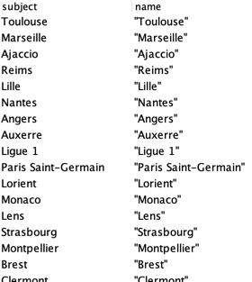
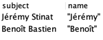
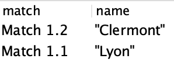
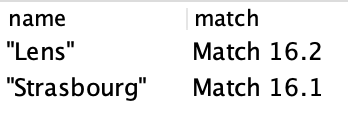
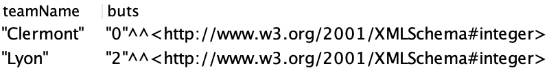

# AI11 - TD 8 

[Hugo Pereira 👨‍💻](https://www.linkedin.com/in/hugopereira75/)

Sujet : [TD8](subject.pdf)

## Exercice 4

### Partie 1

Préfixes utilisés pour toutes les requêtes :

```sparql
PREFIX rdf: <http://www.w3.org/1999/02/22-rdf-syntax-ns#>
PREFIX owl: <http://www.w3.org/2002/07/owl#>
PREFIX rdfs: <http://www.w3.org/2000/01/rdf-schema#>
PREFIX xsd: <http://www.w3.org/2001/XMLSchema#>
PREFIX foaf: <http://xmlns.com/foaf/0.1/>
PREFIX ligue: <http://www.ligue1.fr/terms#>
```

1. **Requête 1** :

> Affichez toutes les instances qui ont la propriété `foaf:name`.

```sparql
SELECT ?subject ?name
WHERE { ?subject foaf:name ?name }
```

On pourrait rajouter un `DISTINCT` dans le `SELECT` pour éviter les doublons.

Résultat :


[...]

2. **Requête 2** :

> Affichez les prénoms des arbitres.

```sparql
SELECT ?subject ?name
WHERE { 
   ?subject a ligue:Arbitre;
   foaf:firstName ?name.
}
```

Résultat :



3. **Requête 3** :

> Affichez les noms des équipes locales qui ont participé aux matchs joués.

```sparql
SELECT ?match ?name
WHERE { 
   ?match a ligue:MatchJoué;
   ligue:ÉquipeLocale ?team.
   ?team foaf:name ?name.
}
```

Résultat :



4. **Requête 4** :

> Affichez les noms des équipes visiteuses qui ont participé aux matchs à venir.

```sparql
SELECT ?match ?name
WHERE { 
   ?match a ligue:Match;
   ligue:ÉquipeHôte ?team.
   ?team foaf:name ?name
}
```

Résultat :



5. **Requête 5** :

> Affichez le nombre de buts marqués par les équipes locales aux matchs joués.

```sparql
SELECT ?teamName (SUM(?goal) AS ?buts)
WHERE { 
  ?match a ligue:MatchJoué ;
  ligue:ÉquipeLocale ?team .
  OPTIONAL { 
    ?match ligue:ButsDomicile ?goal 
  }.
  ?team foaf:name ?teamName .
}
GROUP BY ?teamName
```

Résultat :



### Partie 2

_Ajoutez deux nouvelles propriétés de données scoreFinalDomicile et scoreFinalVisiteuse à la classe MatchJoué et de type entier (xsd:nonNegativeInteger)_

> A l’aide des règles SWRL, ajoutez la signification suivante à l’ontologie : « les buts marqués par les équipes visiteuses aux matchs joués sont doublés dans le score final. »

```
MatchJoué(?match) ^ 
ButsVisiteuse(?match, ?butsVisiteuse) ^
swrlb:multiply(?scoreFinal, ?butsHôte, 2) → 
ScoreFinal(?match, ?scoreFinal)
```